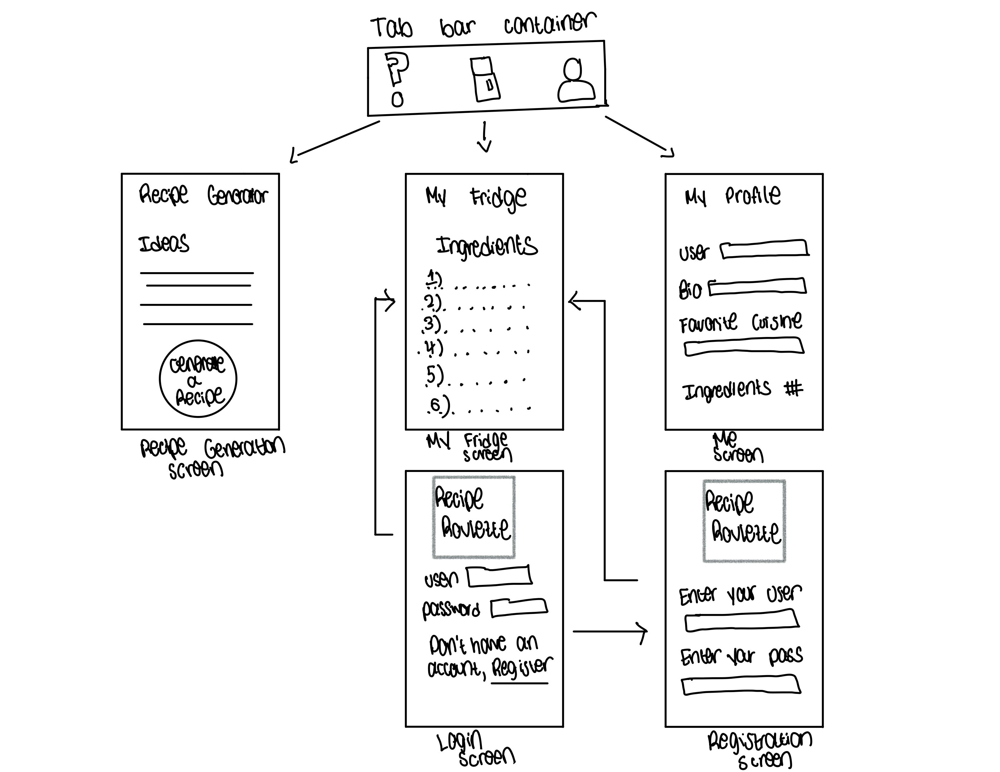

# Recipe Roulette

## Table of Contents

1. [Overview](#Overview)
2. [Product Spec](#Product-Spec)
3. [Wireframes](#Wireframes)
4. [Schema](#Schema)
5. [Sprints](#Sprints)
6. [Video](#Videos)

## Overview

### Description

Recipe Roulette is a fun cooking app that helps users discover new recipes based on their preferences and available ingredients. Users can input their dietary restrictions, favorite cuisines, and ingredients they have on hand, and the app will generate recipe suggestions. The app will focus on the roulette feature where it'll output a random recipe. It also includes step-by-step cooking instructions and tips.
### App Evaluation

[Evaluation of your app across the following attributes]
- **Category:** Lifestyle/Food & Drink
- **Mobile:** Mobile plays a critical role in Recipe Roulette, offering on-the-go access to recipes and ingredients. The app utilizes mobile features such as the camera for user-generated content, allowing users to take pictures and share their own recipes. Additionally, the app can provide real-time updates on popular recipes, enhancing user engagement and relevance. Recipe Roulette extends beyond a mere website by leveraging mobile technology to create a small, portable, and interactive cooking companion that enhances the user experience. API Integration as well by doing integration with recipe databases or APIs like Edamam could significantly enhance Recipe Roulette's recipe database, providing users with a wider variety of recipes and ingredients to explore and enjoy. This integration can enrich the app's content and improve its overall value proposition.
- **Story:** Recipe Roulette offers users a compelling and enjoyable way to discover new recipes and experiment with different cuisines. It provides a platform for culinary exploration and creativity, making cooking more fun and accessible for users of all skill levels. The app's story revolves around empowering users to broaden their culinary horizons and enjoy the process of cooking.
- **Market:** Recipe Roulette targets cooking enthusiasts, busy individuals seeking quick meal ideas, and anyone interested in exploring new cuisines and recipes. The app caters to a diverse audience of food lovers looking for convenient and inspiring cooking solutions, making it relevant to a broad market segment.
- **Habit:** Users are likely to use Recipe Roulette regularly for meal planning and inspiration. The app's user-friendly interface and diverse recipe database make it a valuable resource for users looking to enhance their cooking experience. Users may develop a habit of using the app frequently to discover new recipes and plan meals efficiently.
- **Scope:** Version 1 of Recipe Roulette could focus on basic recipe browsing and saving functionalities, allowing users to discover and save recipes for future reference. Subsequent versions could expand the app's scope to include features like meal planning, shopping lists, and user-generated content, enriching the user experience and increasing engagement over time.

## Product Spec

### 1. User Stories (Required and Optional)

**Required Must-have Stories**

* User can create a new account
* User can login
* User can view their profile information
* User can upload and view ingredients they have
* User can upload and view their own recipe ideas
* User can see a randomly generated recipe

**Optional Nice-to-have Stories**

* User can upload a picture of a recipe they made
* User can add captions to their post
* Users can comment on posts
* Users can like posts
* Users can enter ingredients that they currently have to receive a recipe with those ingredients
* User can enter ingredients that they want mimicking a grocery list
* User can receive a recipe that contains both ingredients they have and ingredients they want
* Users can enter a cuisine to receive a recipe from that culture
* User can see a picture displaying the randomly generated recipe

### 2. Screen Archetypes

- [ ] Login Screen
* User can login
- [ ] Registration Screen
* User can create a new account
- [ ] Recipe Generation Screen
* User can see a randomly generated recipe
* User can upload recipe ideas
- [ ] My Fridge
* User can upload and view ingredients they have
- [ ] Me
* User can view their profile information

### 3. Navigation

**Tab Navigation** (Tab to Screen)

* Recipe Generation Screen
* My Fridge
* Me

**Flow Navigation** (Screen to Screen)

- [ ] Login Screen
* => My Fridge
- [ ] Login Screen
* => Registration Screen
- [ ] Registration Screen
* => My Fridge

## Wireframes

### [BONUS] Digital Wireframes & Mockups

N/A

### [BONUS] Interactive Prototype

N/A

## Schema 

[This section will be completed in Unit 9]

### Models

[Add table of models]

### Networking

- [Add list of network requests by screen ]
- [Create basic snippets for each Parse network request]
- [OPTIONAL: List endpoints if using existing API such as Yelp]

## Sprints
- [X] Week 8/Sprint 1: Create and setup an Xcode project for the app. Add a logo to the app. App should build.  
      - Challenges faced: The wireframe was difficult to draw as I'm not the most artistic and am not really good at making UI/UX. Also, did not write any code because the app
        brainstorming, choosing, and designing took a while. This was a no-code week.
- [ ] Week 9/Sprint 2: Created a login page with its UI.
      - Challenges faced: 
- [ ] Week 10/Sprint 3:  
      - Challenges faced:

## Videos
- Week 8/Sprint 1: https://www.loom.com/share/ec50e3cc8b37462ea994a64a0593cd86?sid=c87fbecf-b1a3-44ef-8e54-89b26dea871c
- Week 9/Sprint 2: https://www.loom.com/share/2cce079dfa7444fe87437cc3fbf520b6?sid=bd1bc7d4-25c5-40d3-90e4-ec3deb47ad6d

